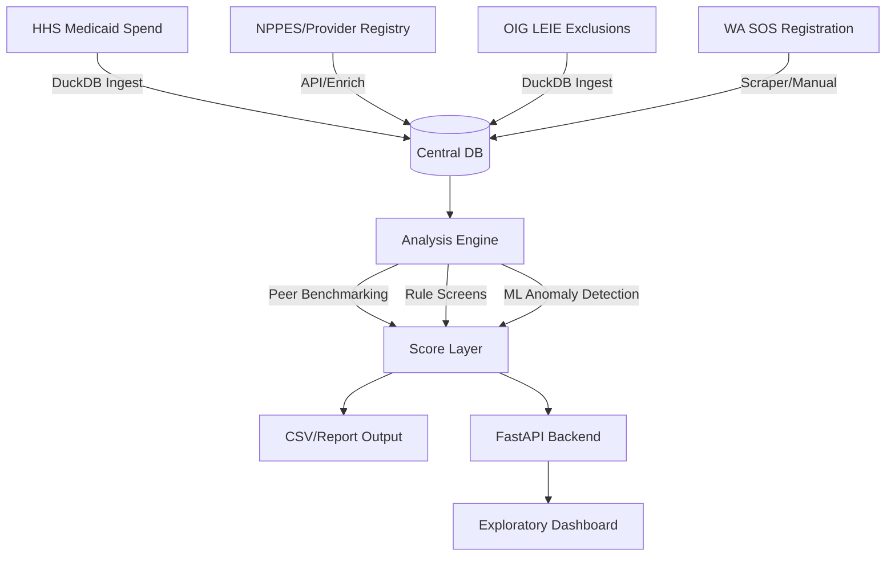

# Project Architecture v2: Medicaid Fraud-Signal Platform

This document outlines the scalable architecture for the `wa-clark-medicaid-spend-watch` project evolution.

## 1. High-Level Workflow



## 2. Folder Structure

```text
.
├── data/
│   ├── raw/            # Immuntable source files
│   └── processed/      # Managed DuckDB files (*.db)
├── docs/               # Documentation and Ethics
├── notebooks/          # Exploratory research
├── reports/            # Human-readable findings
├── src/
│   ├── analysis/       # Core Anomaly Engines
│   ├── api/            # FastAPI app
│   ├── database/       # DB Connection & DDL
│   └── ingestion/      # Pipelines for HHS, NPPES, LEIE
├── sql/                # SQL DDL and Migrations
└── web/                # Svelte/Vanilla JS Frontend
```

## 3. Data Model (Relational)

We center the model on the **Provider (NPI)** and **Program/Period**.

### Key Tables

#### `providers`
- `npi` (PK): VARCHAR (Supports legacy IDs & NPPES NPIs)
- `name`: VARCHAR
- `taxonomy_desc`: VARCHAR
- `is_excluded`: BOOLEAN (Join key for LEIE)
- `risk_score`: DOUBLE (Global ML anomaly score)

#### `medicaid_spend`
- `billing_npi` (FK): VARCHAR
- `servicing_npi` (FK): VARCHAR
- `hcpcs_code`: VARCHAR
- `period`: DATE (YYYY-MM-01)
- `total_paid`: DOUBLE
- `total_claims`: INTEGER
- `unique_beneficiaries`: INTEGER

#### `risk_flags`
- `npi` (FK): VARCHAR
- `flag_type`: VARCHAR (e.g., 'PRICE_Z_SCORE_OUTLIER', 'SUDDEN_UTILIZATION')
- `flag_score`: DOUBLE
- `reason`: VARCHAR (Explainer)
- `detected_at`: TIMESTAMP

## 4. Technology Choices

- **Database**: **DuckDB**. Extremely fast for analytical queries on multi-GB datasets, serverless, and stores data in a single file.
- **Backend**: **FastAPI** (Python). Modern, fast, and easy to document with Swagger.
- **Analysis**: **Scikit-Learn** (Isolation Forest) and **DuckDB SQL** (for window-function based peer groupings).
- **Frontend**: **Vanilla JS + Tailwind**. Keep it lightweight and maintainable.

## 5. Scaling Strategy
- **Geography**: All queries should filter by `state` and `county` (derived from zip/address) by default.
- **Configuration**: Use `.env` or `config.yaml` to define the target scope (e.g., `SCAN_SCOPE: Clark County, WA`).
