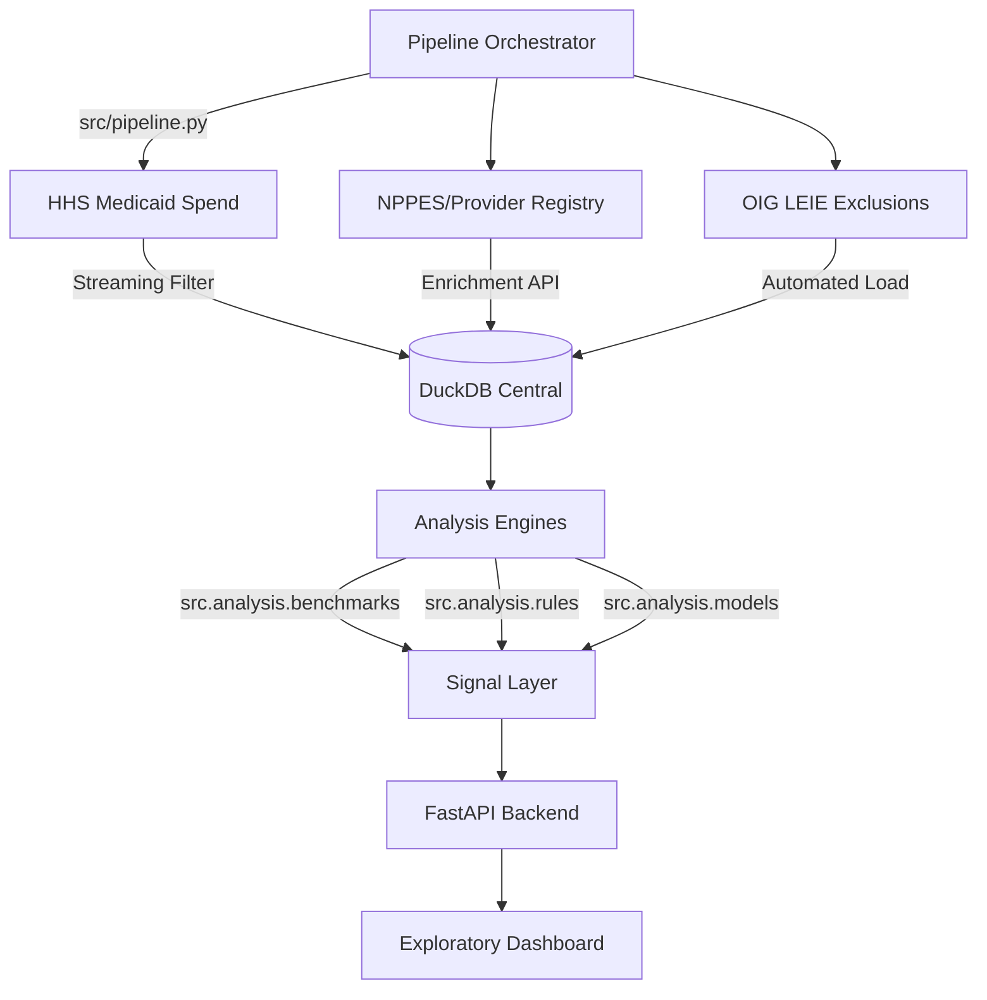

# Project Architecture v3.0: Portable Fraud-Signal Platform

This document outlines the scalable v3.0 architecture designed for multi-county portability and high-performance ingestion.

## 1. High-Level Workflow (Orchestrated)



## 2. Folder Structure

```text
.
├── data/               # DuckDB processed files & raw scope jsons
├── docs/               # Architecture, Ethics, and Data Sources
├── reports/            # Human-readable findings
├── src/
│   ├── analysis/       # Core Anomaly Engines (Rule & ML)
│   ├── api/            # FastAPI App & Endpoints
│   ├── ingestion/      # Streaming Pipelines (HHS, LEIE)
│   ├── config.py       # Centralized Settings (Pydantic)
│   └── pipeline.py     # Master Orchestrator (DAG)
├── tests/              # Pytest Suite (Validation)
├── sql/                # SQL Relational Schemas
└── web/                # Vanilla JS Dashboard
```

## 3. Data Model (Relational)

We utilize a relational star schema centered on the **Provider (NPI)** and **Program/Period**.

### Core Tables
*   **`providers`**: Master metadata, corporate leadership, and exclusion status.
*   **`medicaid_spend`**: Periodical spending at the NPI × HCPCS level.
*   **`risk_flags`**: Detected anomalies with scores and standardized reasons.
*   **`benchmarks`**: Pre-calculated peer average prices and volumes for Z-score calc.

## 4. Key Improvements in v3.0

1.  **DuckDB Streaming**: We use `read_csv` on remote URLs to filter multi-GB datasets without local extraction.
2.  **Centralized Config**: Every threshold and path is managed in `src.config.Settings`.
3.  **Automated Testing**: Essential mathematical logic is verified via `pytest` to prevent logic drift.

## 5. Scaling & Portability Strategy
The platform is designed to be "ported" to any county in minutes:
1.  Update `TARGET_COUNTY` and `TARGET_STATE` in `src/config.py`.
2.  Run `python src/pipeline.py`.
3.  The orchestrator builds a fresh, isolated database for that specific jurisdiction.
